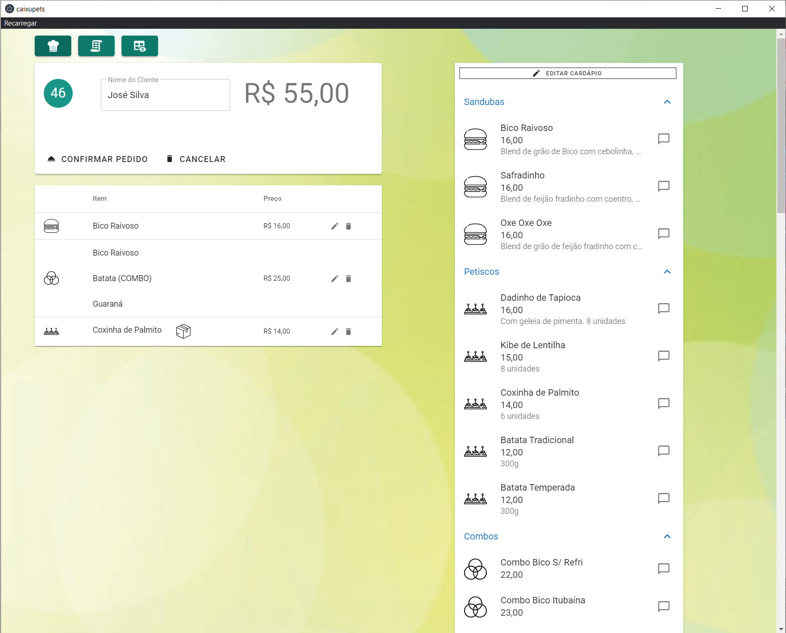
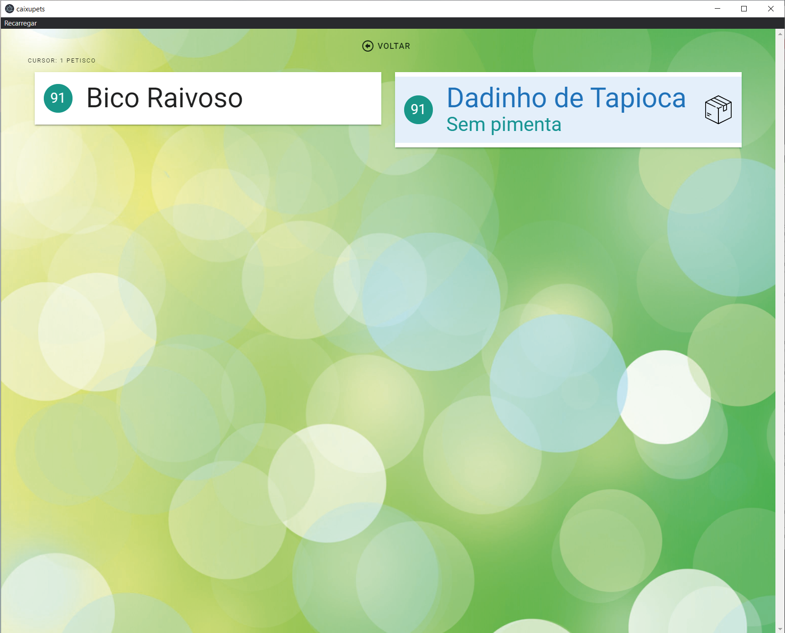
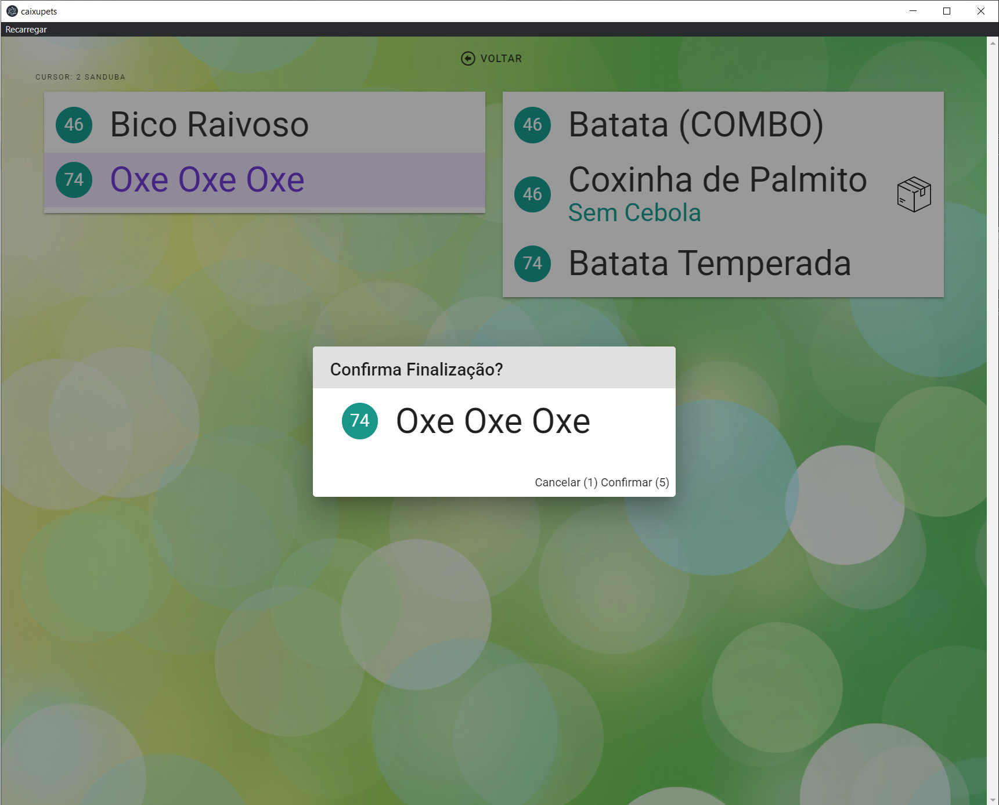
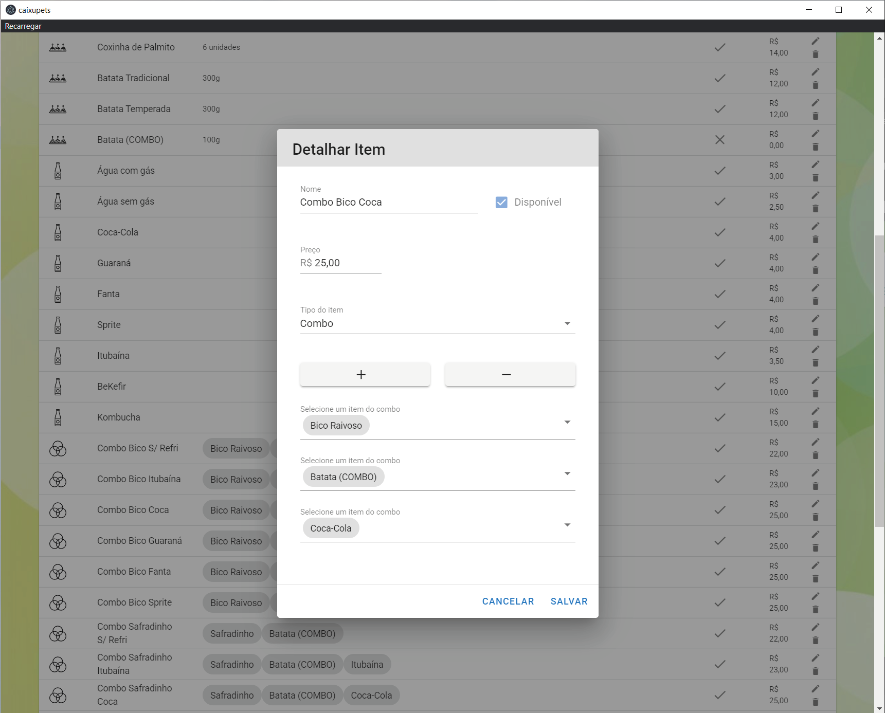
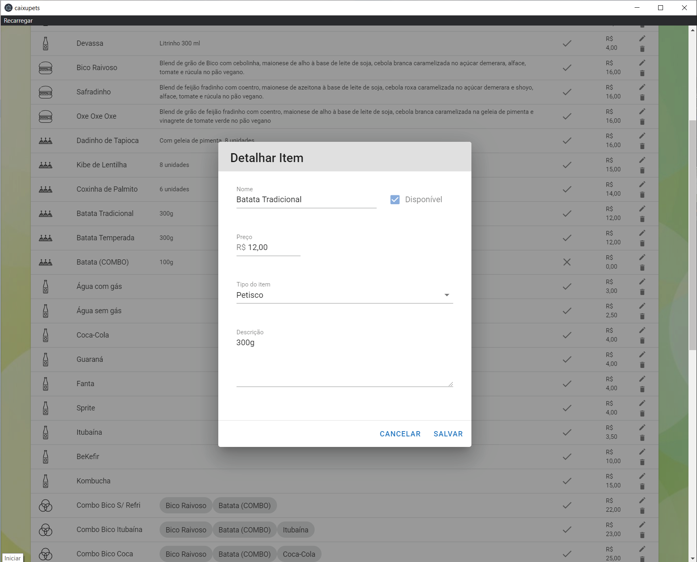
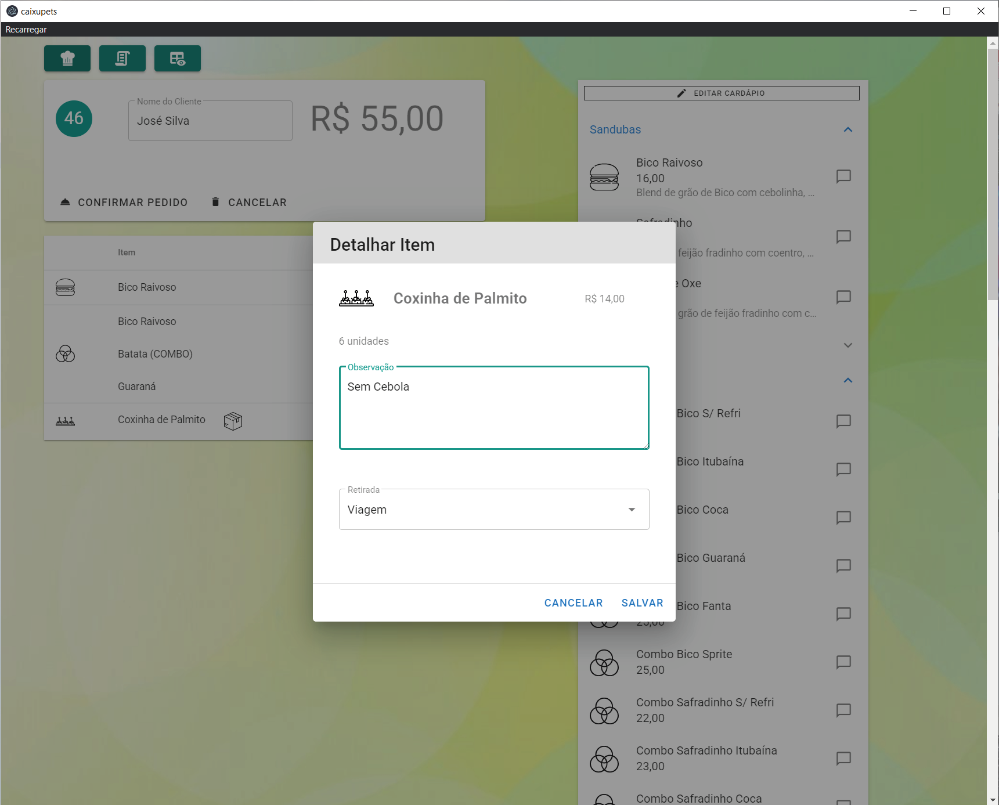
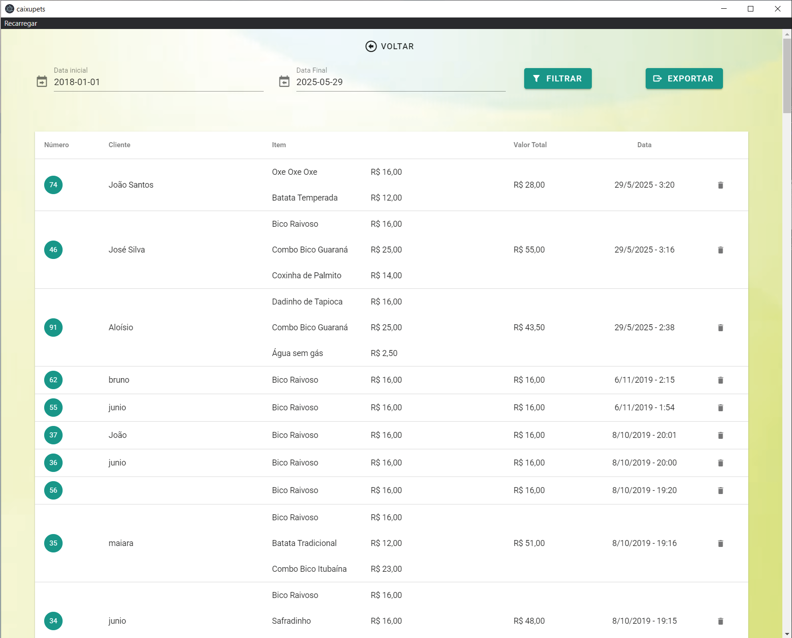
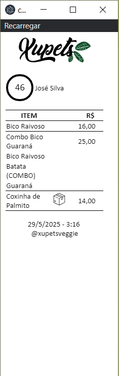

# 🍔 Caixupets (Showcase)

**Caixupets** is a point-of-sale system developed for the vegan burger restaurant [Xupets](https://www.instagram.com/xupetsveggie/). Built with **Vue** and **Electron**, it features independent interfaces for cashier and kitchen, full item control, combo management, thermal printing, and detailed sales tracking.

This repository serves as a **public showcase**. The source code is private and available upon request.

---

## 🛠️ Tech Stack

- **Vue.js** for the interface
- **Electron** for desktop integration
- **Thermal printer support** (kitchen and customer receipts)
- Offline-ready and lightweight

---

## 🧾 Features

- Dual-screen workflow (cashier ↔ kitchen)
- Combo and product configuration
- Real-time order updates with item notes
- Order history and receipt printing
- Visual status tracking in the kitchen
- Toggle availability of products dynamically

---

## 📸 Screenshots

### Cashier screen

### Kitchen screen (initial)

### Kitchen screen (items display)

### Kitchen screen (order finalized)

### Menu: Combos and Items

### Order Detail and History

### Printed Coupon

---

## 🔒 Licensing & Availability

This software was developed exclusively for internal use by Xupets.  
The code is not open-source, but **demo access** can be provided upon request.

---

## 📬 Contact

If you’re interested in similar solutions or technical insights:

**aloisiovilasboas@gmail.com**
