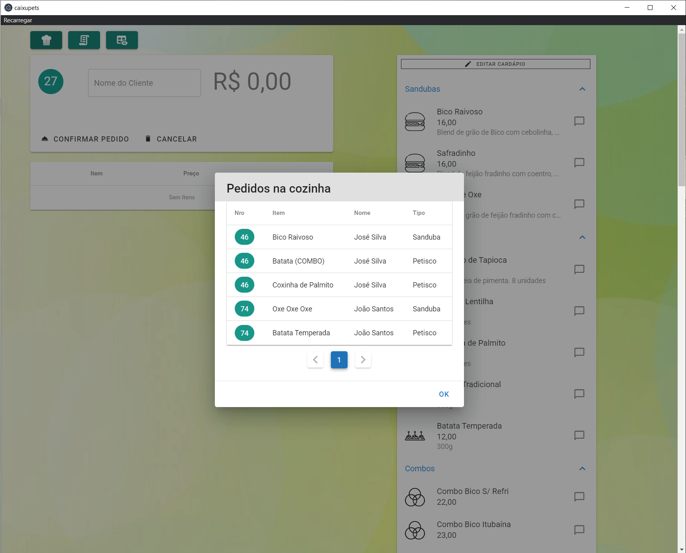

# 🍔 Caixupets (Showcase)

**Caixupets** is a point-of-sale system developed for the vegan burger restaurant [Xupets](https://www.instagram.com/xupetsveggie/).  
Built with **Vue** and **Electron**, it features independent interfaces for cashier and kitchen, full item control, combo management, thermal printing, and detailed sales tracking.

> 🔒 **Note:**
> This repository is publicly available for portfolio and demonstration purposes only.
> The source code is proprietary and available upon request for non-commercial evaluation.

---

## 🛠️ Tech Stack

- **Vue.js** for the interface
- **Electron** for desktop deployment
- **Thermal printer support (POS58)** (kitchen and customer receipts)
- Offline-ready and lightweight

---

## 🧾 Features

- Dual-screen workflow (cashier ↔ kitchen)
- Orders confirmed at the cashier are automatically sent to the kitchen screen
- Kitchen interface is operable via **numeric keypad** for fast and hands-free operation
- Cashier has full access to kitchen orders for monitoring and control
- Combo and product customization (e.g., "no onion", "extra sauce", "takeaway")
- Visual indicators for **delivery types**: *Delivery*, *Takeaway*, and *In-store*, displayed clearly in the kitchen
- Real-time order updates with item notes
- Toggle product availability dynamically
- Order history with **CSV export**
- Receipt and kitchen ticket printing

---

## 📸 Screenshots

### Cashier screen

### Kitchen screen (initial)

### Kitchen screen (items display)

### Kitchen screen (order finalized)

### Menu: Combos and Items

### Order Detail and History

### Printed Coupon

---

## 🔒 Licensing & Availability

This software is provided for **personal and non-commercial use only**.  
Developed exclusively for internal use by [Xupets](https://www.instagram.com/xupetsveggie/).  
All rights reserved.

---

## 📦 Project Status

**Completed and delivered.**  

---

## 📬 Contact

For inquiries or similar projects:  
**aloisiovilasboas@gmail.com**
